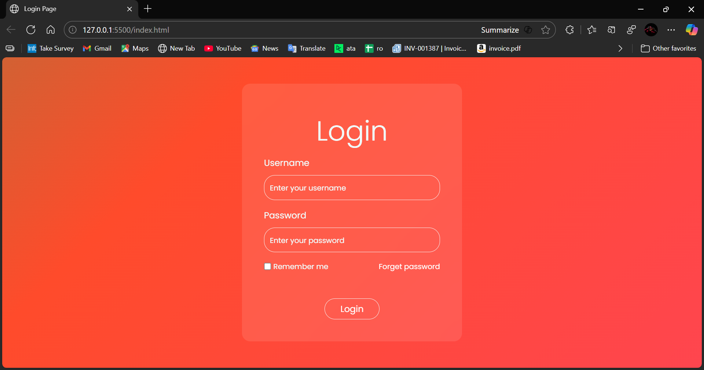

# Login Page

A **responsive login page** built using HTML, CSS, and JavaScript. This project demonstrates a clean and modern login interface that can be integrated into web applications.

## Features

- Clean and modern design
- Responsive layout for desktop and mobile devices
- Basic form validation for username and password
- Easy to customize and integrate

## Technologies Used

- HTML5
- CSS3
- JavaScript (Vanilla JS)

## Screenshot

  
*(Optional: Add a screenshot of your login page here)*

## Usage

1. Clone this repository:

```bash
git clone https://github.com/Deepakch-7/login-page-formate.git
